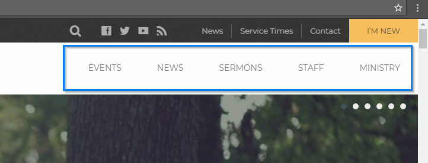

# Menus

Camden theme support [Custom Navigation Menu](http://en.support.wordpress.com/menus/ ":target=_blank"). Custom Menu enables you to easily customize the navigation menu in this theme.

How to Create Menu
1. Navigate to __Appearance__ > __Menus__.
2. If you don’t have any menus configured, click __Create Menu__.
3. From the boxes on the left select menu item (Pages, Posts, or Custom Links) that you want to include in your menu. Click __Add to Menu__.
4. Expand the Menu Item to configure available options (Label and Attribute).
5. You can change the order and placement of menu items by simply dragging and dropping the items to change their order and create sub-menus. Click __Save Menu__ once you're done.
6. Navigate to __Manage Locations__ tab and assign your menu to a theme location. Click __Save Changes__.

?> More info on [How To Set Up Menus](https://en.support.wordpress.com/menus/ ":target=_blank")

There are five menu locations where you can add your menus.

#### 1. Primary Menu   

#### 2. Mobile Menu
Mobile menu only will be displayed on screen size 1024px and smaller. If there's no menu assigned to Mobile Menu location, it will show the same menu assigned to __Primary Menu__ location.

#### 3. Footer Menu

#### 4. Top bar Menu

#### 5. Top bar CTA
