# Theme Options

Camden theme comes with Theme Options page. It allows users to change theme settings without modifying theme files.  Navigate to __Dashboard__ > __Theme Options__ to access the Theme Options.

## General
-----
  
1. __Favicon__ — upload image to replace the default favicon. Recommended format: .ICO.

- __Hide Sidebar__ — hide sidebar on certain pages or post types.

- __Read More Text__ — replace default __Read More__ text with different text.

- __Navigation__ 
  - __Sticky Navigation - Small__  — enable sticky navigation on small screen (< 1025px). 
  
  - __Sticky Navigation - Large__ — 	enable sticky navigation on large screen (> 1024px).
  
  - __Child Pages Navigation__ — display child page items on the sidebar. It will only be displayed if the current page has any child page.
  
    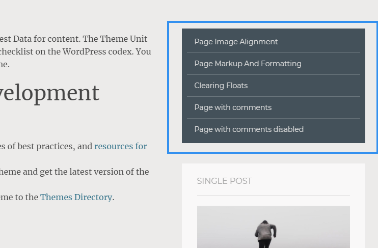 
    
  - __Hide Post Navigation__ — hide previous and next posts navigation.
  
    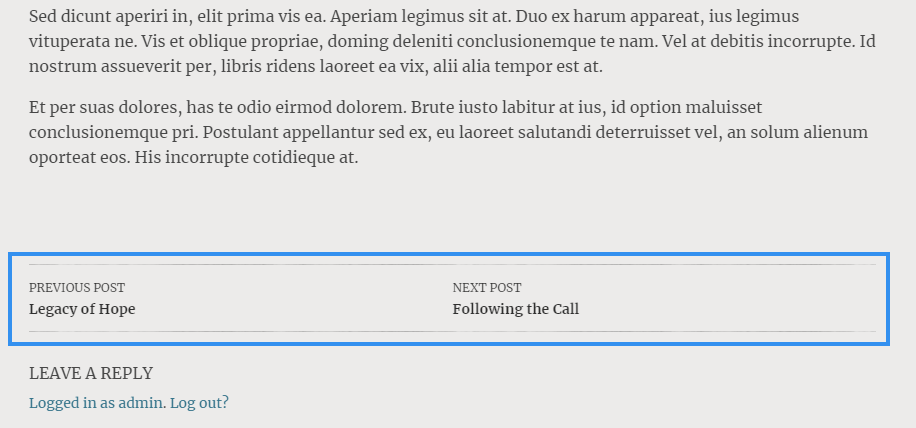
    
  - __Hide Breadcrumbs__ — hide breadcrumbs on certain post types. 
  
    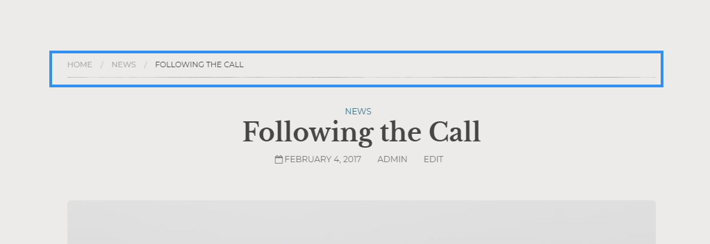

- __Comments__ 
  - __Post Comments__ — option to display post comments on Post globally. Single Post Discussion settings will override this option. 
  - __Sermon Comments__ — option to display post comments on Sermon Post Type globally. Single Sermon Discussion settings will override this option. 

- __Script__ 
  - __JavaScript Snippet__ — use this field to add JavaScript snippet.
  - __Analytics Snippet__ — use this field to add tracking code such as Google Analytics.

## Front Page
-----

### Layout
Drag and drop the layout item to organize how you want the layout to appear on the homepage. The page layout is divided into 2 section:

1. __Upper Section__ — Upper section of the homepage layout. It's located below the slider.
                    
- __Lower / Main Section__ — Lower section of the homepage layout. It contains most of the homepage content.
  
### Slider

Slider image on the homepage.

1. __Slider Transition__ — Slider transition animation.
                    
- __Transition Speed__ — Slide transition speed in milliseconds. This option only works when Slide transition is selected. Default: 400.

- __Slideshow Speed__ — Slideshow transition speed between slides in milliseconds. Set to 0 to disable auto play. Default: 5000.

- __Control Navigation__ — Display the slider bullet navigation.

- __Direction Navigation__ — Display previous or next slider navigation.

- __Auto Play__ — Enable / disable  auto play.

- __Pause on Hover__ — Pause slider animation on mouse hover.

- __Text Animation__ — Enable text animation when slider change.

  
### Call to Action Module
A section to display Call to Action buttons.

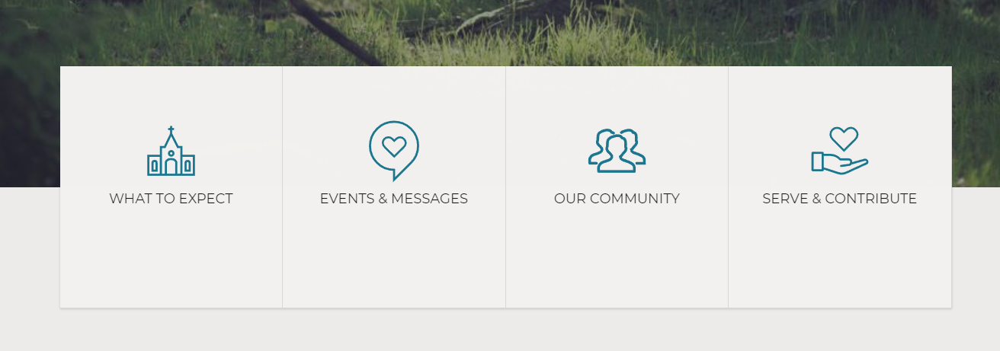

1. __CTA Item__ — Add CTA title, description and image. Recommended image size: 280px x 280px.
                    
- __CTA Columns - Large__ — Amount of CTA columns on large screens (min-width 1025px).

- __CTA Columns - Medium__ — Amount of CTA columns on medium screens (max-width 1024px).

- __CTA Columns - Small__ — Amount of CTA columns on small screens (max-width 640px).

### Intro Module
A section to display a brief information or introduction.

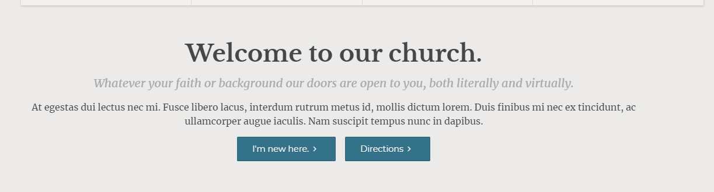

1. __Heading__ — Intro module heading.
                    
- __Subheading__ — Intro module subheading.

- __Content__ — Intro module content. 

- __Layout__ — Intro module layout. 

- __Buttons__ 
  - __Button 1 Text__  — Intro module button text.
  - __Button 1 URL__ — Intro module button URL.
  - __Button 2 Text__ — Intro module button text.
  - __Button 2 URL__ — Intro module button URL.

### Content Module
A section to display the homepage content. This will display the content of the Page that is set as the homepage.

1. __Background__ — Choose module background properties — image, color, etc..
  
### Feature Module
A section to display featured content on the homepage.

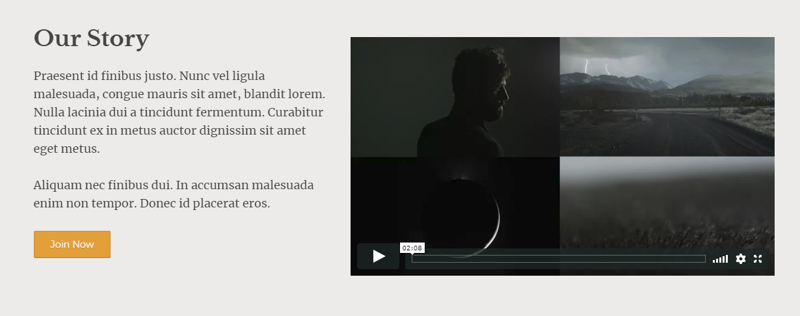

1. __Amount of Posts__ — the amount of Posts to be displayed.

- __Featured Content__ 
  - __Heading__  — post heading.
  - __Content__ — post content.
  - __Button Text__  
  - __Button URL__ 
  - __Media__ — media type to be displayed.
  - __Image__ — post image.
  - __Layout__ — post layout.
  - __Background__ — post background properties.
  
### Video Module

A section to display video in a background.

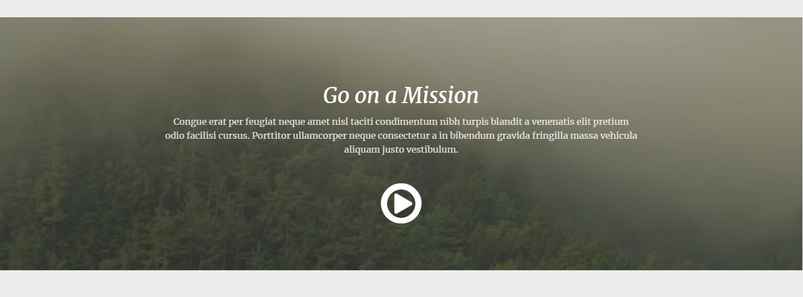

1. __Heading__ — video module heading.
                   
- __Content__ — video module content.

- __Background Video__ 
  - __Video (MP4)__  — background video in .MP4 format.
  - __Video (WebM)__ — background video in .WebM format.
  - __Video (OGV)__  — background video in .OGV format.
  - __Fallback Image__ — image to be displayed if the browser does not support HTML5 video.

- __Main Video__ 
  - __Source__  — main video in .MP4 format.
  - __Video (MP4)__ — main video in .WebM format.
  - __Video (WebM)__ — main video in .OGV format.
  - __Video (OGV)__  — main video in .OGV format.
  - __Fallback Image__ — image to be displayed if the browser does not support HTML5 video.

### Posts Module
A section to Posts on the homepage.

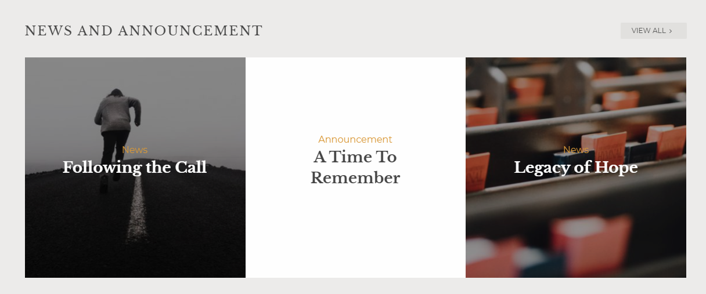

1. __Heading__ 
                   
- __View All Page__ — select where the View All button link to. Usually it's the Posts or Blog page.

- __View All Button Text__ — replace __View All__ text with other text. Default: View All.

- __Category__ — display only Posts from these categories.

- __Posts Amount__ — maximum amount of posts to display. Default: 3.

- __Grid Column__ — amount of grid columns on large screen.

- __Excerpt__ — display Post excerpt.

- __Background__ — choose module background properties — image, color, etc.

### Twitter Module

A section to display Twitter feed.

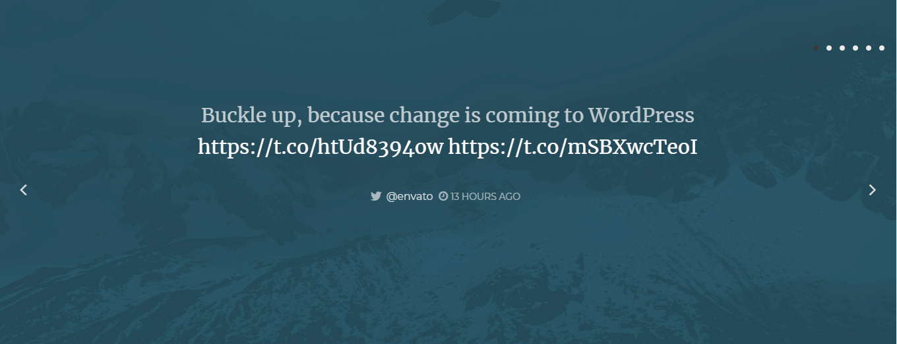

1. __Heading__ —  Twitter module heading.
                   
- __Amount of Tweet__ — amount of tweet to display. Default: 6.

- __Background__ — module background properties — image, color, etc.

- __Control Navigation__ — display the slide bullet navigation.

- __Twitter Token__ — enter Twitter Keys and Access Tokens. Generate it from [developer.twitter.com/en/docs/basics/authentication/guides/access-tokens.html](https://developer.twitter.com/en/docs/basics/authentication/guides/access-tokens.html)

### Ministry Module

A section to display ministries.

IMG

1. __Heading__ — Ministry module heading.
                   
- __Content__ — Content below heading.

- __View All Page__ — Select the ministry parent page or where the View All button link to. Default: `/ministries`.

- __View All Button Text__ — Replace View All text with other text.

- __Amount of Posts__ — Maximum amount of Ministry to display. Default: 12.

- __Background__ — Choose module background properties — image, color, etc.

### Sermons Module

A section to display the latest sermons.

IMG 

1. __Heading__ — Sermons module heading.
                 
- __View All Page__ — Select the Sermons parent page where the View All button links to. Default: `/sermons`.

- __View All Button Text__ — Replace View All text with other text.

- __Background__ — Choose module background properties — image, color, etc.

### Events Module
A section to display upcoming events.

IMG

!> NOTE: Events Module requires [The Events Calendar](https://wordpress.org/plugins/the-events-calendar/ ":target=_blank") plugin.
   
1. __Heading__ — Events module heading.
                 
- __Posts Amount__ — Maximum amount of upcoming events to display. Default: 12.

- __Background__ — Choose Events module background properties — image, color, etc.

- __Control Navigation__ — Display the previous / next events button.

### Gallery Module

A slideshow component for cycling through elements—images or slides of text—like a carousel.

IMG

1. __Heading__ — Gallery module heading.
                 
- __Content__ — Gallery module content. HTML allowed.

- __Background__ — Gallery module background properties — image, color, etc.

- __Add/Edit Image__ — Select images to be displayed using the WordPress native uploader

- __Control Navigation__ — Display the previous / next images button.

## Header
-----
1. __Layout__ — page header layout.

  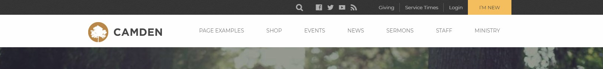
  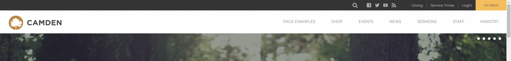

- __Main Logo__ — main logo image on page header.

  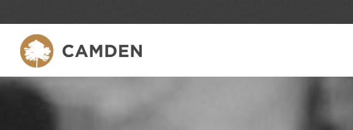

- __Alternative Logo__ — alternative logo on smaller screen or mobile.

  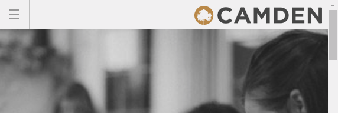

- __Social Icon URLs__ — social media links. Add social media URL to display the icon.

  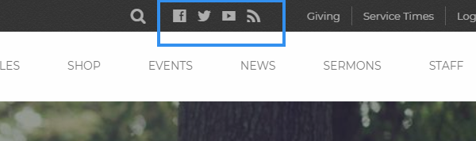

- __Search Bar - Header__ — enable search bar on page header.

  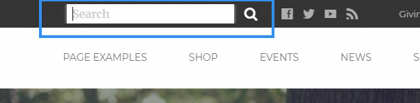

- __Search Bar - Mobile Menu__ — enable search bar on mobile menu.

  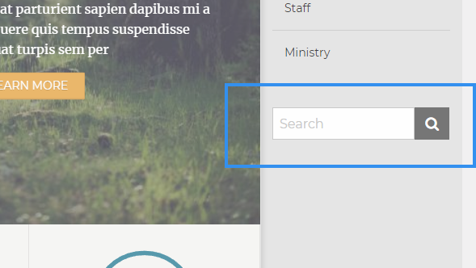

## Footer
-----
1. __Widgets Size__ — the amount of footer widgets columns.
- __Copyright Text__ — footer copyright notice text.
- __Social Icons__ — add social URL (Facebook, Twitter, etc.) to display social icons. 
- __Show Call to Action__ — display Call to Action section on page footer.
- __Heading__ — Call to Action heading.
- __Button Text__ — Call to Action button text.
- __Button URL__ —  Call to Action URL.

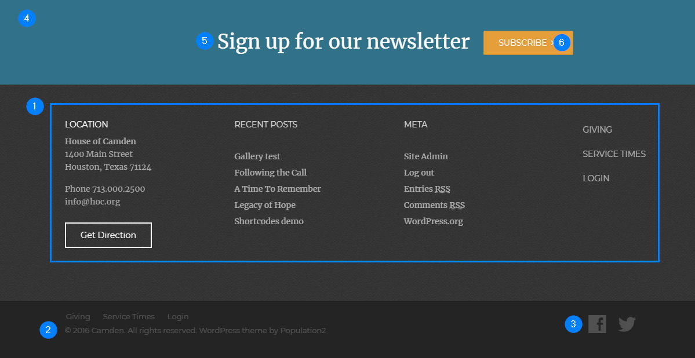

## Custom Post Type
-----
!> The Custom Post Type (Ministry, Sermons, and People) in this theme requires [Church Theme Content](https://wordpress.org/plugins/church-theme-content ":target=_blank") plugin.

### Ministry Page
Options for Ministry landing page.
1. __Page Header Background__ — select page header background color or image. This will override __Page Hero Header Background Color__ (Theme Options > Style)

- __Page Heading__ — ministry page title. Default: Ministry.

- __Page Subheading__ — ministry page subheading.

  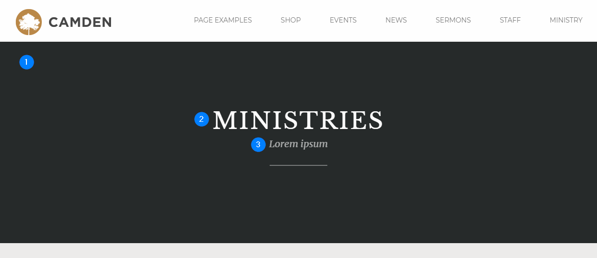

### Sermons Page
1. __Page Header Background__ — select page header background color or image. This will override __Page Hero Header Background Color__ (Theme Options > Style)

- __Page Heading__ — sermons page title. Default: Sermons.

- __Page Subheading__ — sermons page subheading.

- __Featured Sermon__ 
  - __Featured Sermon__  — enable Featured Sermon.
  - __Background__ — select Featured Sermon background color or image.
  
  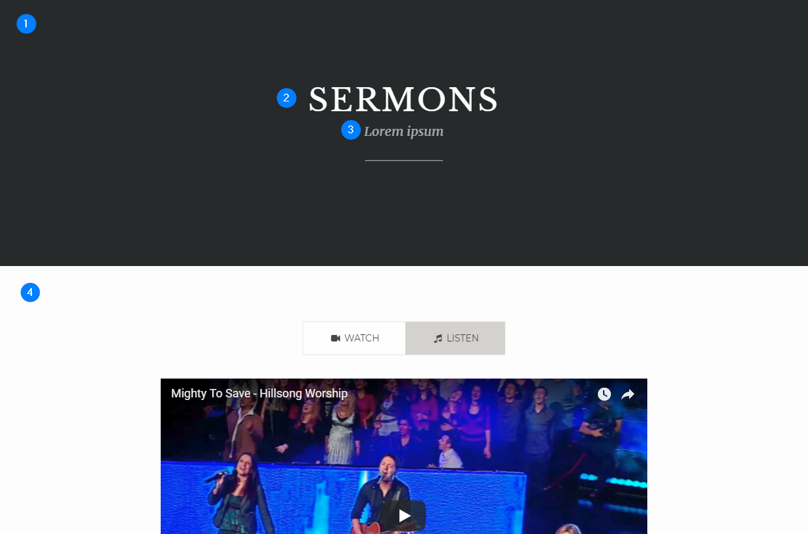

### People Page
1. __Page Header Background__ — select page header background color or image. This will override __Page Hero Header Background Color__ (Theme Options > Style)

- __Page Heading__ —— people page title. Default: People.

- __Page Subheading__ —— people page subheading.

  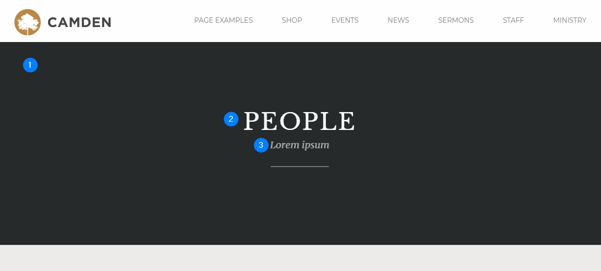

## Style
-----

The Style options offer users the ability to customize the default theme styling.

?> You'll need to supply Google API Key to be able to use Google Fonts. Read [Google API Guide](guide/google-api.md) for more information.

### Typography
1. __Body Font__ — body or main font properties.

  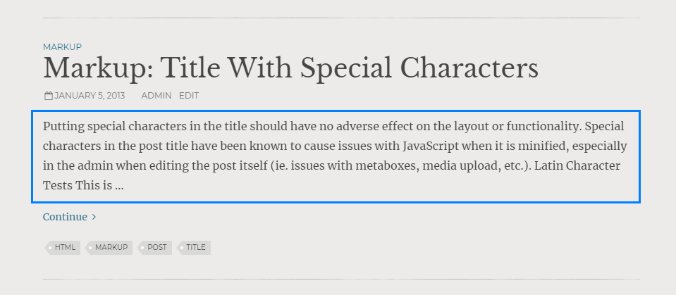
  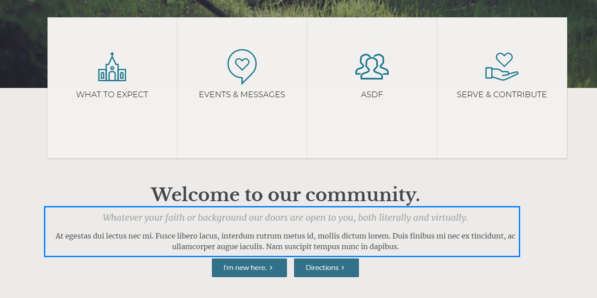

- __Primary Heading__ — primary heading (e.g., heading, post title, widget title) font properties.

  
  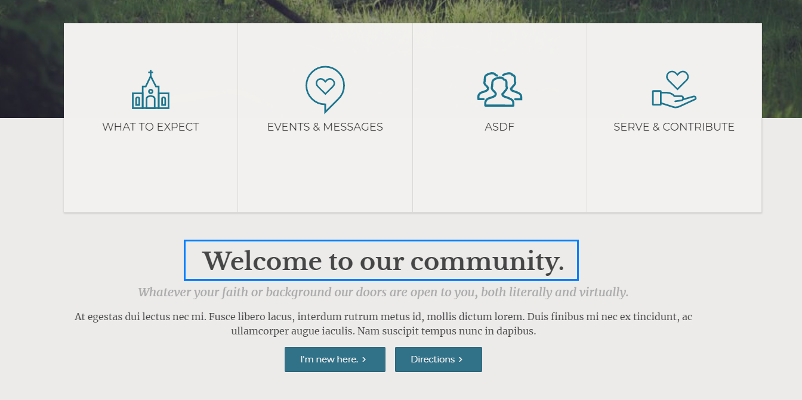
- __Secondary Heading__ — secondary heading (e.g., subheading, navigation, post metadata, caption, buttons ) font properties.

  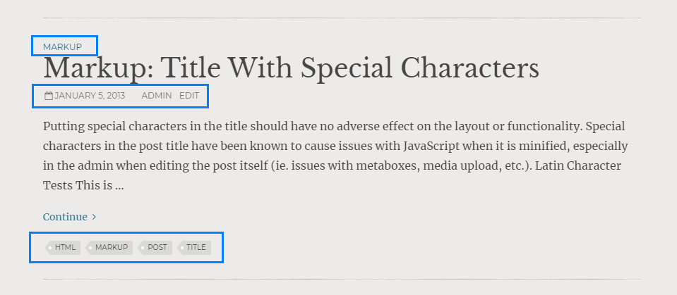
  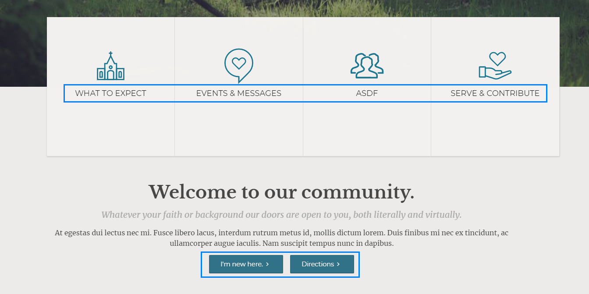
- __Body Text Color__ — body or main font color.

- __Primary Link Color__ — primary link color (e.g., link, read more button, post metadata, post title (on hover), main navigation (on hover) ).
  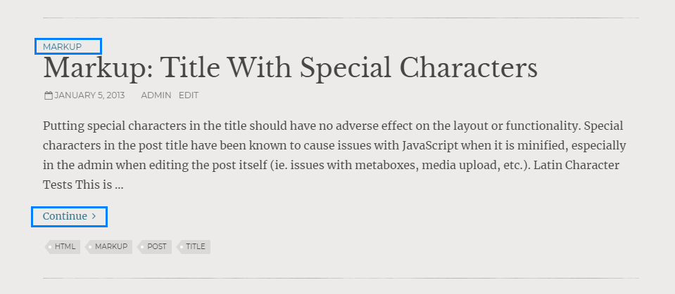

- __Secondary Link Color__ — secondary link color (e.g., tags (on hover), homepage Twitter link (on hover), footer widget link (on hover) ).
  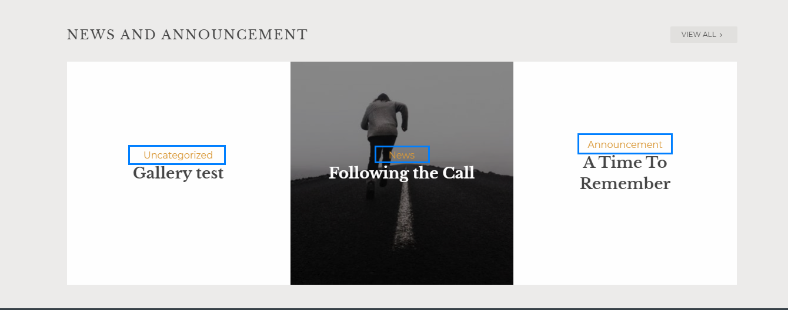
  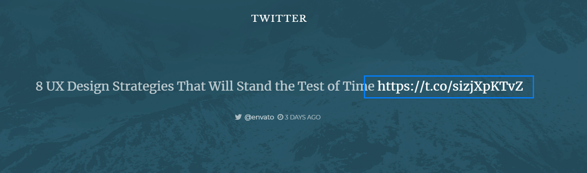

### Backgrounds

1. __Body Background Color__ — Main `<body>` background color.

- __Primary Header Background Color__ — background color of page header where primary navigation and logo located. 

- __Secondary Header Background Colors__ — background color of Secondary header where secondary navigation and social links located.

- __Secondary Header Button Color__ — button color of top bar CTA.

  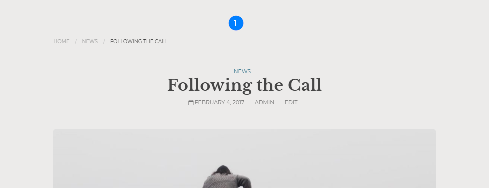
  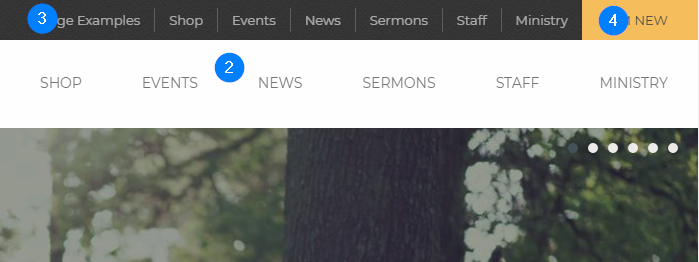
- __Page Hero Header Background Color__ — background color of page header.

- __Primary Sidebar Background Color__ — background color of page sidebar.

- __Sidebar Child Page Navigation Background Color__ — background color of child page navigation on sidebar.

  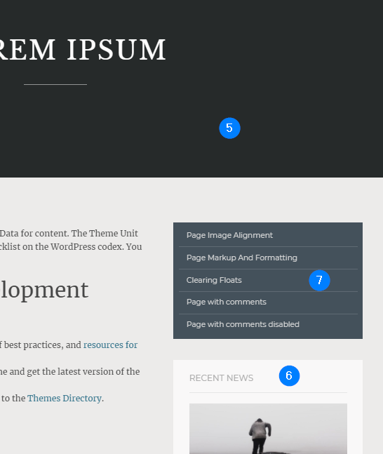
  
- __Footer CTA Background__ — background color or image of footer where CTA located.
- __Footer Top Background__ — background color or image of footer where the widget area located.
- __Footer Bottom Background__ — background color or image of footer where copyright note located.

  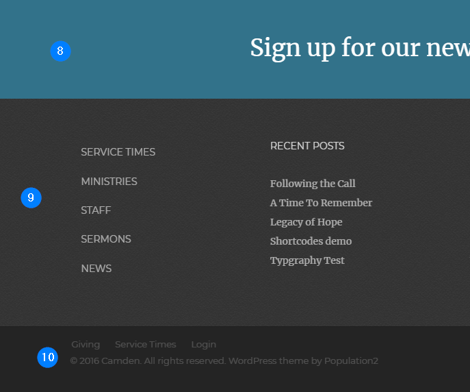

### Buttons

- __Primary Button Color__ — primary button background color.

- __Primary Button Color — on Hover__ — primary button background color on mouse hover.

- __Secondary Button Color__ — secondary button background color.

- __Secondary Button Color — on Hover__ — secondary button background color on mouse hover.

- __Default Button Color__ — default button background color.

- __Default Button Color — on Hover__ — default button background color on mouse hover.

### CSS

- __Custom CSS__ — takes [CSS](https://developer.mozilla.org/en-US/docs/Web/CSS  ":target=_blank") file (*.css) to override theme stylesheet.
- __Custom CSS Code__ — takes [CSS](https://developer.mozilla.org/en-US/docs/Web/CSS  ":target=_blank") code to override theme stylesheet.

?> While this Custom CSS is available, we recommend using [Child Theme](https://codex.wordpress.org/Child_Themes ':target=_blank') to customize the theme. 

## Import / Export
-----

The Import / Export feature offers users the ability to back up and restore their Theme Options options data. Users can import/export the data in one of three ways: raw data, file, and URL.

### How To Export Theme Settings
You can save your theme options settings and restore the settings.

1. Go To __Theme Options__ > __Import / Export__.
2. From the bottom of the screen, click on Settings
Click on Export Theme Settings
Click on Export to download your theme settings file (.json)

### How To Import Theme Settings
Import your previously saved theme settings.

1. Go To __Theme Options__ > __Import / Export__.
2. Click __Download Data File__ or __Copy Export URL__.