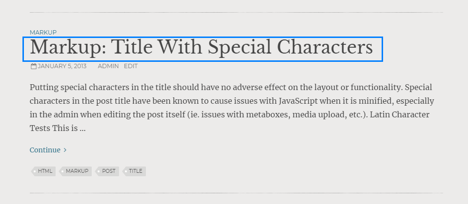
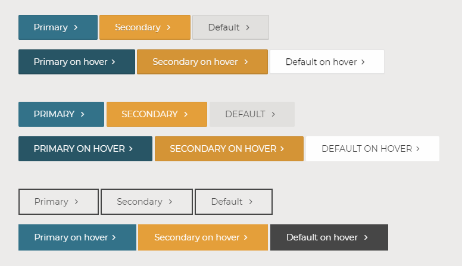
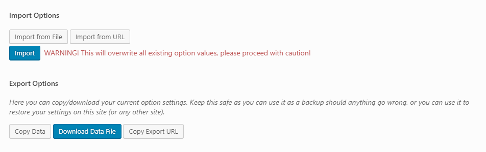

# Theme Options

Camden theme comes with Theme Options page. It allows users to change theme settings without modifying theme files.  Navigate to __Dashboard__ > __Theme Options__ to access the Theme Options.

## General
-----
some desc

- __Favicon__ —
  

- __Hide Sidebar__ —
  

- __Read More Text__ —
  

### Navigation
- __Sticky Navigation - Small__ —

- __Sticky Navigation - Large__ —

- __Child Pages Navigation__ —

- __Hide Post Navigation__ —

- __Hide Breadcrumbs__ —

### Comments
- __Post Comments__ — option to display comments on Post globally. Single Post Discussion settings will override this option. 
- __Sermon Comments__ — option to display comments on Sermon Post Type globally. Single Sermon Discussion settings will override this option. 

### Script
- __Custom JS Snippet__ — use this field to add JavaScript snippet.
- __Analytics Snippet__ — use this field to add tracking code such as Google Analytics.

## Front Page
-----

### Layout
### Slider
### Call to Action Module
### Intro Module
### Content Module
### Feature Module
### Video Module
### Posts Module

### Twitter Module

### Ministry Module

### Sermons Module

### Events Module

### Gallery Module

## Header
-----

## Footer
-----
1. __Widgets Size__ — select the amount of footer widgets columns.
- __Copyright Text__ — footer copyright notice text.
- __Social Icons__ — add social URL (Facebook, Twitter, etc.) to display social icons.
- __Show Call to Action__ — display Call to Action on page footer.
- __Heading__ — Call to Action heading.
- __Button Text__ — Call to Action button text.
- __Button URL__ —  Call to Action URL.
-----
### Widgets Size

## Custom Post Type
-----
!> The Custom Post Type (Ministry, Sermons, and People) in this theme requires [Church Theme Content](https://wordpress.org/plugins/church-theme-content ":target=_blank") plugin.

### Ministry Page
Options for Ministry landing page.
1. __Page Header Background__ — select page header background color or image. This will override __Page Hero Header Background Color__ (Theme Options > Style)

- __Page Heading__ — ministry page title. Default: Ministry.

- __Page Subheading__ — ministry page subheading.

  

### Sermons Page
1. __Page Header Background__ — select page header background color or image. This will override __Page Hero Header Background Color__ (Theme Options > Style)

- __Page Heading__ — sermons page title. Default: Sermons.

- __Page Subheading__ — sermons page subheading.

- __Featured Sermon__ 
  - __Featured Sermon__  — enable Featured Sermon.
  - __Background__ — select Featured Sermon background color or image.
  
  

### People Page
1. __Page Header Background__ — select page header background color or image. This will override __Page Hero Header Background Color__ (Theme Options > Style)

- __Page Heading__ —— people page title. Default: People.

- __Page Subheading__ —— people page subheading.

  

## Style
-----

The Style options offer users the ability to customize the default theme styling.

?> You'll need to supply Google API Key to be able to use Google Fonts. Read [Google API Guide](guide/google-api.md) for more information.

### Typography
1. __Body Font__ — body or main font properties.

  
  

- __Primary Heading__ — primary heading (e.g., heading, post title, widget title) font properties.

  
  
- __Secondary Heading__ — secondary heading (e.g., subheading, navigation, post metadata, caption, buttons ) font properties.

  
  
- __Body Text Color__ — body or main font color.

- __Primary Link Color__ — primary link color (e.g., link, read more button, post metadata, post title (on hover), main navigation (on hover) ).
  

- __Secondary Link Color__ — secondary link color (e.g., tags (on hover), homepage Twitter link (on hover), footer widget link (on hover) ).
  
  

### Backgrounds

1. __Body Background Color__ — Main `<body>` background color.

- __Primary Header Background Color__ — background color of page header where primary navigation and logo located. 

- __Secondary Header Background Colors__ — background color of Secondary header where secondary navigation and social links located.

- __Secondary Header Button Color__ — button color of top bar CTA.

  
  
- __Page Hero Header Background Color__ — background color of page header.

- __Primary Sidebar Background Color__ — background color of page sidebar.

- __Sidebar Child Page Navigation Background Color__ — background color of child page navigation on sidebar.

  
  
- __Footer CTA Background__ — background color or image of footer where CTA located.
- __Footer Top Background__ — background color or image of footer where the widget area located.
- __Footer Bottom Background__ — background color or image of footer where copyright note located.

  

### Buttons

- __Primary Button Color__ — primary button background color.

- __Primary Button Color — on Hover__ — primary button background color on mouse hover.

- __Secondary Button Color__ — secondary button background color.

- __Secondary Button Color — on Hover__ — secondary button background color on mouse hover.

- __Default Button Color__ — default button background color.

- __Default Button Color — on Hover__ — default button background color on mouse hover.

### CSS

- __Custom CSS__ — takes [CSS](https://developer.mozilla.org/en-US/docs/Web/CSS  ":target=_blank") file (*.css) to override theme stylesheet.
- __Custom CSS Code__ — takes [CSS](https://developer.mozilla.org/en-US/docs/Web/CSS  ":target=_blank") code to override theme stylesheet.

?> While this Custom CSS is available, we recommend using [Child Theme](https://codex.wordpress.org/Child_Themes ':target=_blank') to customize the theme. 

## Import / Export
-----

The Import / Export feature offers users the ability to back up and restore their Theme Options options data. Users can import/export the data in one of three ways: raw data, file, and URL.

### How To Export Theme Settings
You can save your theme options settings and restore the settings.

1. Go To __Theme Options__ > __Import / Export__.
2. From the bottom of the screen, click on Settings
Click on Export Theme Settings
Click on Export to download your theme settings file (.json)

### How To Import Theme Settings
Import your previously saved theme settings.

1. Go To __Theme Options__ > __Import / Export__.
2. Click __Download Data File__ or __Copy Export URL__.