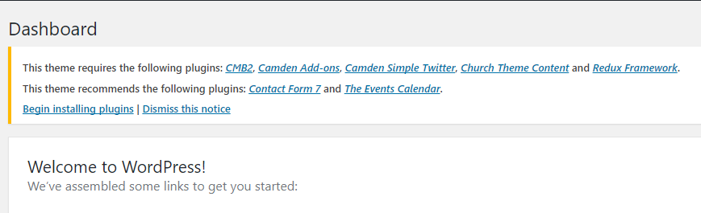
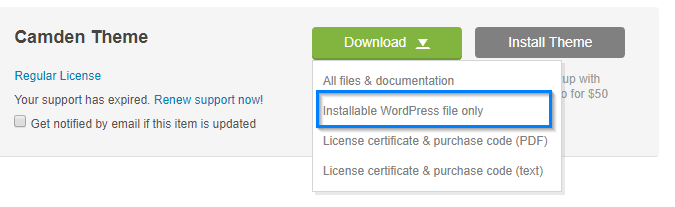
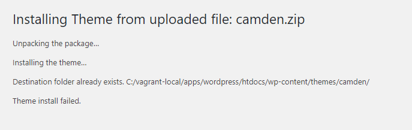

# Installation & Update

Camden theme can only be used with a working version of WordPress. We strongly recommend you to do a fresh WordPress installation and integrate your content into the pages accordingly. This theme has specific settings that might conflict with your current WordPress themes, plugins, database, etc.

?>This page contain beginners guide to WordPress theme, skip to [the next page]() if you are already comfortable with WordPress.

If you need help installing WordPress, follow the documentation in WordPress Codex. Below are some useful WordPress information to help you get started:

- [WP101 Basix Training videos](https://code.tutsplus.com/series/beginning-with-wordpress--wp-33808) — some great videos from TutsPlus on WordPress
- [WordPress Lessons](http://codex.wordpress.org/WordPress_Lessons) — general information that covers a vast array of topics
- [FAQ New To WordPress](http://codex.wordpress.org/FAQ_New_To_WordPress) — the most popular FAQ’s regarding WordPress

## WordPress Installation

1. Download and unzip the WordPress package if you haven't already.
2. Create a database for WordPress on your web server, as well as a MySQL user who has all privileges for accessing and modifying it.
3. (Optional) Find and rename `wp-config-sample.php` to `wp-config.php`, then edit the file (see [Editing wp-config.php](http://codex.wordpress.org/Editing_wp-config.php)) and add your database information.
4. Upload the WordPress files to the desired location on your web server:
   - If you want to integrate WordPress into the root of your domain (e.g. `http://example.com/` ), move or upload all contents of the unzipped WordPress directory (excluding the WordPress directory itself) into the root directory of your web server.
   - If you want to have your WordPress installation in its own subdirectory on your web site (e.g. `http://example.com/blog/` ), create the `blog` directory on your server and upload the contents of the unzipped WordPress package to the directory via FTP.
   - **Note**: _If your FTP client has an option to convert file names to lower case, make sure it's disabled_.
5. Run the WordPress installation script by accessing the URL in a web browser. This should be the URL where you uploaded the WordPress files.
   - If you installed WordPress in the root directory, you should visit: `http://example.com/`
   - If you installed WordPress in its own subdirectory called `blog`, for example, you should visit: `http://example.com/blog/`

[More detailed instructions](http://codex.wordpress.org/Installing_WordPress#Detailed_Instructions).

## Theme Installation

The first step in getting started with our themes is installing them. There are two ways to do this, Theme Install from **Administration Panels** and **FTP**. Sometimes installation via **Administration Panels** may not work for you, usually because of a server restriction such as memory. In that case, you will need to install your theme manually via **FTP**.

### Adding New Themes using the Administration Panels

1. Log in to the WordPress [Administration Panels](http://codex.wordpress.org/Administration_Panels).
2. Select the [Appearance](http://codex.wordpress.org/Administration_Panels#Appearance_-_Change_the_Look_of_your_Blog) panel, then [Themes](http://codex.wordpress.org/Administration_Panels#Themes).
3. Click **Add New**.
4. Click **Upload New** and choose the theme file(.zip) that you have previously downloaded to your machine.
5. Wait until the theme is uploaded and installed.
6. Activate the theme.

### Adding New Themes Manually (FTP)

To add a new Theme to your WordPress installation, follow these steps:

1. Download the Theme archive (.zip) and extract the files it contains.
2. There will be a few folders such as documentation. Take note of the folder of your theme name. You will only need to upload `camden` folder.
3. Start up your FTP client. We recommend using [FileZilla](http://filezilla-project.org/) since it is free and cross-platform.
4. Find the directory where the WordPress installed. It is usually located at `/public_html/wp-content/themes/`.
5. Upload the Theme files to the new directory on your host server.
6. Follow the instructions below for selecting the new Theme.

### Selecting the Active Theme

To select Camden theme for your site:

1. Log in to the WordPress [Administration Panels](http://codex.wordpress.org/Administration_Panels).
2. Select the [Appearance](http://codex.wordpress.org/Administration_Panels#Appearance_-_Change_the_Look_of_your_Blog) panel, then [Themes](http://codex.wordpress.org/Administration_Panels#Themes).
3. From the Themes panel, select Camden theme and click the **Activate** button.

Your selection should immediately become active.

If you get the **Are You Sure You Want To Do This** message when installing the theme via WordPress Administration Panels, make sure that you only upload the theme file, not the whole package. If the error message persists, install the theme via FTP, or increase your `max_execution_time`, `max_input_time`, and `memory_limit` via the `php.ini`. Ask your hosting company if you are not comfortable modifying php.ini.

## Plugin Installation

To install the required plugins:

1. Log in to the WordPress [Administration Panels](http://codex.wordpress.org/Administration_Panels).
2. Select **Begin installing plugins**. WordPress will download and install all the required plugins.

## What’s Included in the Package

When you purchase our theme from Themeforest, you need to download the theme files from your Themeforest account. Navigate to your downloads tab on Themeforest and find the theme. Click the download button to see the two options. The **Main Files** contain everything, and the **Installable WordPress Theme** is the WordPress theme file only. Below is a full list of what is included along with a brief description of each item:

- **Camden Theme Folder** – contains the camden.zip and camden-child.zip WordPress theme. The child theme is only for users who make code changes.
- **Licensing Folder** – contains the licensing files, this is not your purchase code that you need to download from Themeforest.

## How To Update WordPress Theme

When a new version of your theme become available you will get an email notification from Themeforest. You can also use [Envato Toolkit Plugin](https://github.com/envato/envato-wordpress-toolkit). You will receive notification in your WordPress Dashboard once the theme is updated. Please read the changelog so you can see what was modified in the new version.

We recommend you to keep always your theme updated, to ensure that it is fully compatible with latest WordPress version available.

?>We strongly recommend you to [backing up your database](http://codex.wordpress.org/Backing_Up_Your_Database) and [WordPress files](http://codex.wordpress.org/Backing_Up_Your_WordPress_Files). That way you will not lose any modifications and customizations that you made in your theme.
  
You can update your theme via FTP or WordPress Administration Panels. See the information below for each method.

### Download theme files
  
1. Log into your Envato account and go to Downloads page under your profile name.
2. Find Camden theme click **Download** button next to it and then click **Installable WordPress file only**.

Follow the instructions below for updating via FTP or WordPress Administration Panels.

### Uploading the new version

The easiest way to update your theme is to upload it using **WordPress Administration Panels**

But because you already have a theme folder on your server with the same name as the folder inside your ZIP file of updated theme, most likely you will get the following error:

To avoid this error you have several choices:

### A. Delete your current theme

- Deactivate the theme you want to update, enabling another theme (e.g. Twenty Seventeen ) (theme can not be deleted if it is active).
- Delete the theme.
- Now you can go to Themes page and install the updated version of the theme.

### B. Rename your current theme folder via FTP

- Log in to your site via FTP client.
- Go to `wp-content/themes` and rename your current theme folder (e.g. **camden** ) to something else (e.g. **camden-backup** ), without adding any spaces in the folder name.
- Go back to WordPress Administration Panel and install the new version the theme.
- Delete the theme you just renamed (e.g. **camden-backup** ) after successfully updating the theme.

### C. Manually update only modified files

- If your theme was previously modified or customized, you can update manually only files that were modified in newer versions than yours.
- Look in the changelog of your theme to see which files were modified or added and replace them via FTP.

#### What if my theme was modified?

- Update via FTP only modified files that are listed in the changelog
- If you don’t remember what modifications you did in your theme, just compare files from your current theme folder with the new version using a tool like [Beyond Compare](http://www.scootersoftware.com/moreinfo.php) ( Windows & Linux ), [WinMerge](http://winmerge.org/) (Windows) or [DiffFork](http://www.dotfork.com/difffork//) (Mac)