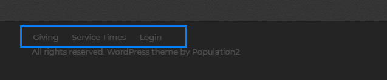
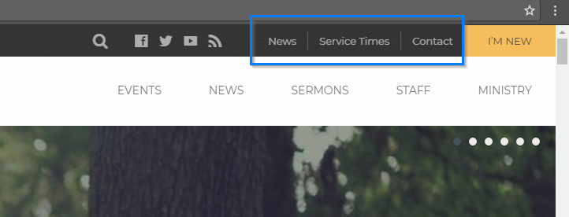
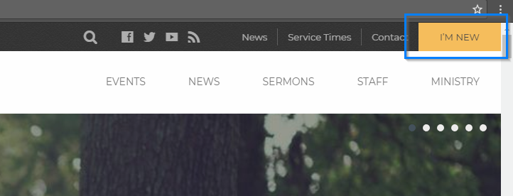

# Menus

[How To Set Up Menus](https://en.support.wordpress.com/menus/ ":target=_blank")

Camden comes with 5 menu locations where you can add your menus.

### Primary Menu   

### Mobile Menu
Mobile menu only will be displayed on screen size 1024px and smaller. If there's no menu assigned to Mobile Menu location, it will show the same menu assigned to __Primary Menu__ location.

### Footer Menu

### Top bar Menu

### Top bar CTA
