# Theme Setup

## Setting Up Home Page

1. Navigate to **Pages** > **Add New**.
2. Select **Home Page Template** as the template from the **Page Attributes**.
3. Add a title and content you would like to see within the content area of the static front page, or leave it blank.
4. Publish the Page.
5. Navigate to **Settings** > **Reading**.
6. Select **A static page** option for the **Front page displays**.
7. Select the page you just created as the **Front page**.
8. Navigate to **Theme Options** > **Front Page** and [configure the settings]().

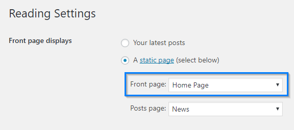

## Setting Up Blog page

1. Navigate to **Pages** > **Add New**.
2. Select **Default Template** as the template from the **Page Attributes**.
3. Add a title and Publish the Page.
4. Navigate to **Settings** > **Reading**
5. Select **A static page** option for the **Front page displays**.
6. Select the page you just created as the **Posts page**.

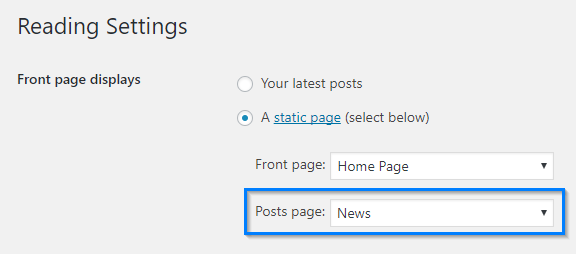

## Page Templates
A Page Template is a template which comes with your theme. WordPress can be configured to use different Page Templates for different Pages. Page templates are used to change the look and feel of a page. You can select which Template will be used when displaying a particular Page.

Camden theme comes with unique page templates which adds additional functionality to your pages. These are the page templates that can be found in this theme:

1. **Home Page** — a page template for Front Page
2. **Full Width Page** — a full width page template without the sidebar.
3. **Times & Directions Page** — a page template to display map and service times.
4. **Contact Page** — a page template with contact form

### How To Change a Page Template

1. Navigate to **Pages** and select the page
2. On the right hand side under **Page Attributes** you’ll see template. This is where users are able to access your global page templates.
3. Select the Page Template.

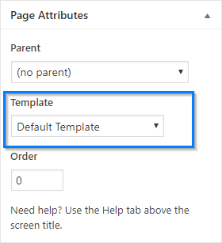

?>**Could not find the Page Attribute panel?**  
  If you do not see this panel, look to the top right of your screen for **Screen Options**. Click **Screen Options** and check the **Page Attributes** checkbox.
  
### Contact Page
Camden theme comes with a Contact Page template to embed contact form in a single column. You will need contact form plugin such as Contact Form 7 or Gravity Form. We recommend Contact Form 7, since Camden theme integrate custom styling for Contact Form 7 elements.

#### Setting up Contact Page
1. Make sure contact form plugin is activated. We use Contact Form 7 for this example.
2. Create a new Page and change the Template to Contact Page.
3. Create your custom contact form. Check the Contact Form 7 guide for more details.
4. Copy the Contact Form 7 embed code and add it to the contact page text editor.
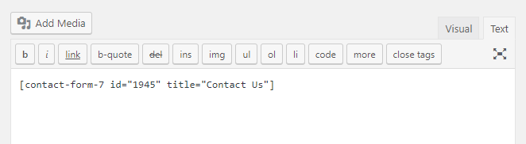 
5. Fill the Contact Info fields with additional info such as address and phone number. 
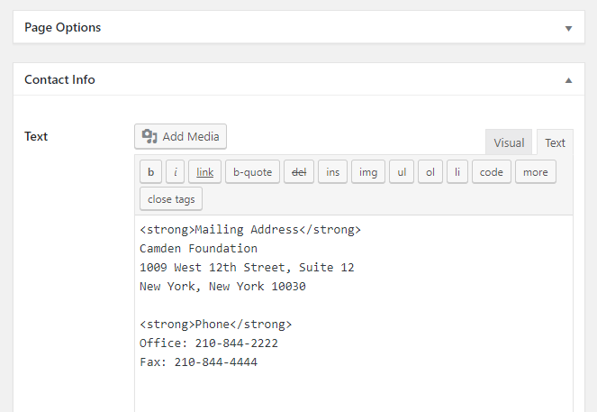

### Times & Direction Page
Camden theme comes with a Times & Direction template to display service times and map. Change page template to **Times & Direction** to enable it.

#### Times & Direction Options

**Service Times Entry**  
Define the service times. It accepts HTML and multiple entries. 

Recommended markup:
```html
<dl>
    <dt>TITLE</dt>
    <dd><span class="time">12:00 AM</span>
    LOCATION
    <a href="URL">View Details</a></dd>
</dl>
```

**Map Image**  
Define the map image URL. You can upload the map image to WordPress Media Library ( Media > Library ) and get the image URL. Alternatively, you may use map image maker such as [Static Map Maker](http://staticmapmaker.com/) to generate the URL.
       
**Direction Info**  
Add short additional info to be displayed next to the map image. It accepts HTML.

**Map URL**  
Define the URL where the Map Image links to, usually it's the share link. 

```html
//Google Map
https://www.google.com/maps/@18.5411754,-80.1912377,15z

//Bing Map
https://binged.it/2fAzbZF
```

## Page Options

Page Options is available on all pages. You can assign header image and page subheading on any Pages.

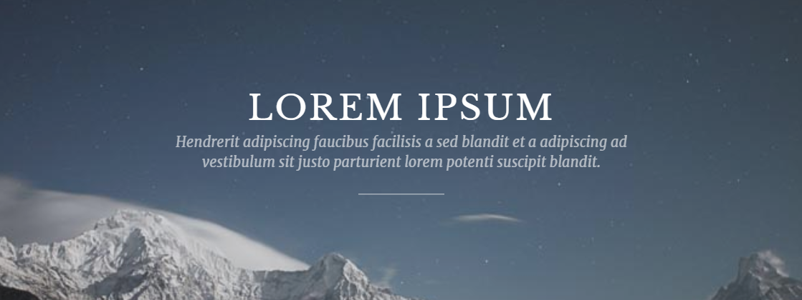 

**Page Header Image**  
Define the header image. You can upload the image or enter a URL. It will display the default solid color (#212526) if there is no header image assigned. You can change the default color from Theme Options (**Theme Options** > **Style** > **Page Hero Header Background Color**).

**Page Subheading**  
Define the subheading text to be displayed below the page title. It's usually a brief description of the page. HTML allowed.

## Custom Post Types Pages


## Slides

The Home Page features a slider. To add a new slide to the slider, follow this steps:

Navigate to Slides > Add New from WordPress dashboard.
Enter slide title.
Click on Featured Image at the bottom right.
Upload an image. You can also drag and drop the image from your computer.
Click Set Featured Image .
Enter all necessary parameters in Slides tab .
Publish the page.
You can modify Slide additional options from Theme Options .
Recommended image size for the slide is 680 px x 320 px
You can change the slide animation, pause time, etc in the Theme Options section.

This theme includes 2 sliders, Orbit Slider and FlexSlider 2. Both slider ready to be used without installing any plugin. The default slider is FlexSlider 2, you can change it to Orbit Slider from the Theme Options.

Orbit Slider can also be generated from Shortcodes. For more information check the Shortcode section below.

### Slides Options

**Slide Type**  
Defines the home page slide layout.

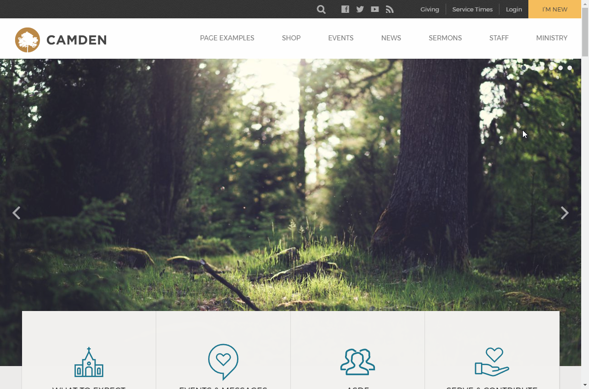
_Image only_

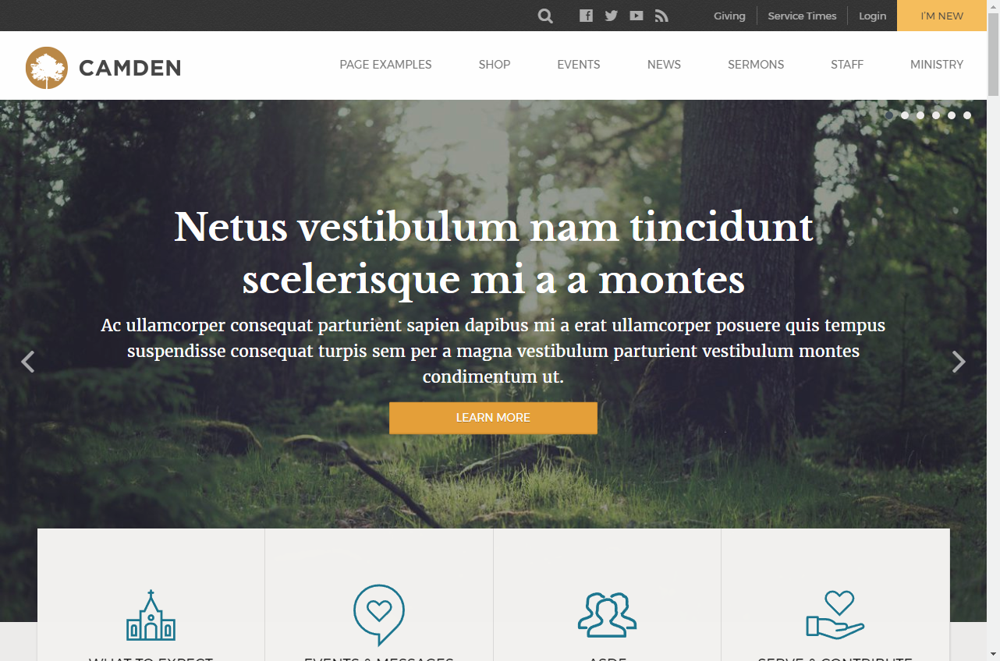
_Image with text in the middle_

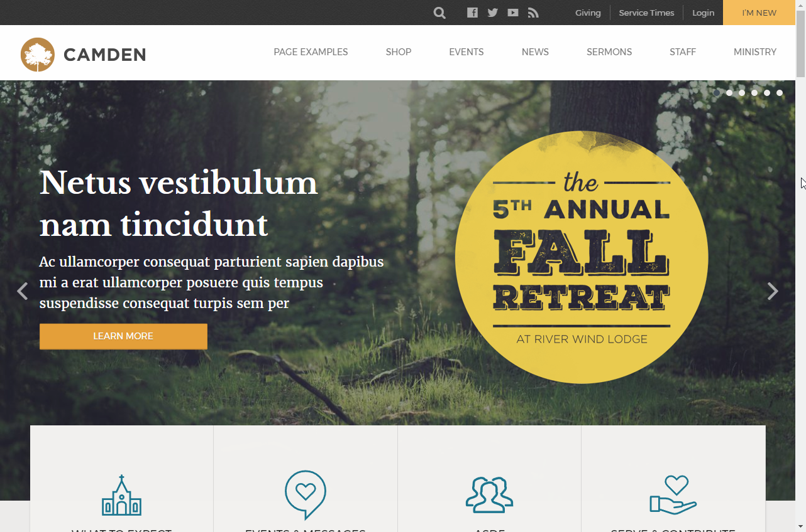
_Image with text on left side_

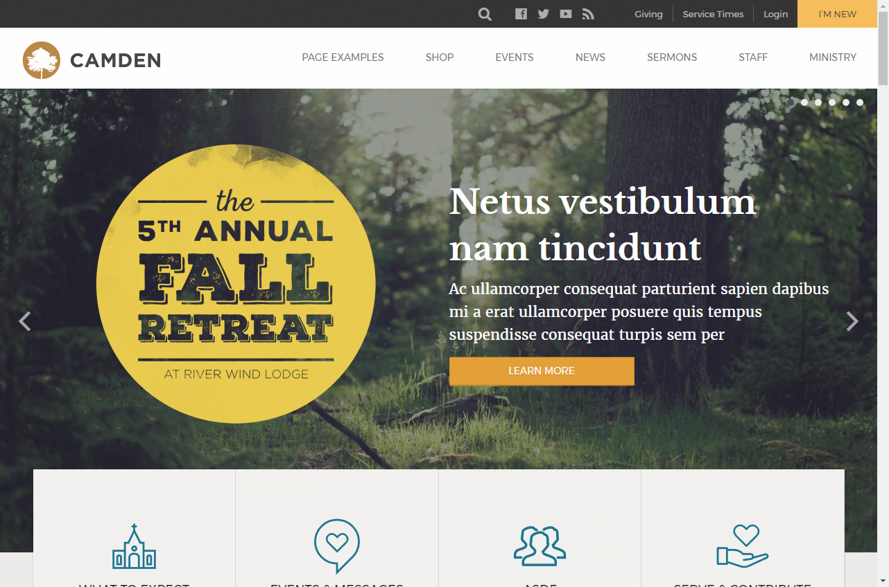
_Image with text on right side_

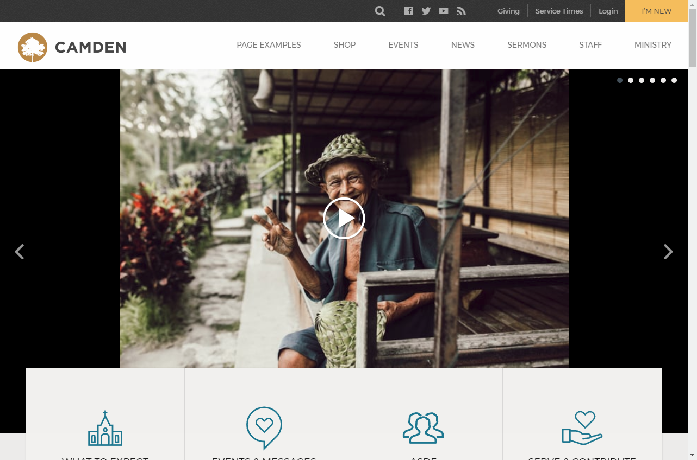
_Video_

**Foreground Image**  
Select image to be displayed in front of the background image. It will be displayed next to Slide Heading. Foreground image will only be displayed if **Image with text on left side** or **Image with text on right side** is selected on Slide Type.

Background image is set via [WordPress Featured Image](https://en.support.wordpress.com/featured-images/).

**Video**  
Select YouTube or Vimeo video to be displayed. Enter the video URL, not the share URL. Make sure **Slide Type** is set to **Video**, otherwise the video won't be displayed.

**Heading**  
Defines the slide heading text.

**Heading Color**  
Defines the slide heading color.

**Subheading**  
Defines the slide subheading text.

**Subheading Color**  
Defines the slide subheading color.

**Text Position**  
Defines the heading and subheading position from the top of background image. Accepts all CSS units (px, em, %).

**Button Text**  
Defines the button text.

**Button URL**  
Defines the button URL. It defines the background image URL if **Slide Type** is **Image only**.

### Slider global options
Slider global options (e.g., transition speed and slideshopw speed ) are available from Theme Options (**Theme Options** > **Front Page** > **Slider**).

More information at: [Theme Options]()

## Post formats

