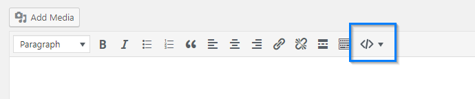
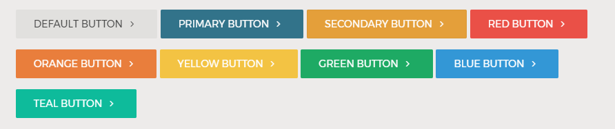

# Shortcodes

Camden theme comes with shortcodes which allow you to create more customized post and page layouts with the help of columns, buttons, lists, etc.

Briefly, shortcode is a special tag that you can enter into a post that gets replaced with different content when actually viewing the post on the website. You can add the shortcodes from the WordPress visual editor. Navigate to a Post or a Page, and find the Shortcode Editor button in the post editor window.

!> NOTE: The shortcodes features requires [Camden Add-ons](https://github.com/populationtwo/camden-add-ons) plugin.
 


## Grid
The grid shortcode in Camden theme is based on 12-column [Foundation Grid system](https://foundation.zurb.com/sites/docs/grid.html).


### 2 Columns

```html
[one_half_alpha] ... [/one_half_alpha]
[one_half_omega] ... [/one_half_omega]
```

### 3 Columns
```html
[one_third_alpha] ... [/one_third_alpha]
[one_third] ... [/one_third]
[one_third_omega] ... [/one_third_omega]
```

### 4 Columns
```html
[one_fourth_alpha] ... [/one_fourth_alpha]
[one_fourth] ... [/one_fourth]
[one_fourth] ... [/one_fourth]
[one_fourth_omega] ... [/one_fourth_omega]
```

### 1/3 & 2/3 Columns
```html
[one_third_alpha] ... [/one_third_alpha]
[two_third_omega] ... [/two_third_omega]
```

### 2/3 & 1/3 Columns
```html
[two_third_alpha] ... [/two_third_alpha]
[one_third_omega] ... [/one_third_omega]
```

### Custom
Custom size grid offer more control of the grid layout. The sum of sizes of all columns started with the first and ended with the last column must not exceed 12.
 
 ```html
[column columns=12]...[/column]

[column columns=7]...[/column][column columns=5]...[/column]

[column columns=3]...[/column][column columns=3]...[/column][column columns=6]...[/column]
 ```
 
 


## Typography
### Check List
### Check List Circle
### Left Pull Quotes
### Right Pull Quotes
### Blockquote

## Media
### Orbit
This is a shortcode to create Orbit responsive slider. It has similar attributes we used in the Clearing shortcode.


Placing [orbit] in your editor creates a responsive slider from all the images attached to the post/page

Attributes:
id — takes a post/page ID, defaults to current post/page
size — size of the images used, defaults to large
include — list of attachment IDs to include
exclude — list of attachment IDs to exclude
How To Use Shortcode Attributes:
Adding attribute to the [orbit] shortcode looks like this: [orbit size="small"]. Adding a second attribute would look as follows: [orbit size="small" exclude="6,3,1"]. It’s only necessary to add a attribute to the shortcode if you wish to override the default attribute.
### Reveal
This is a shortcode to create simple modal windows on your site.

[reveal link="Link text" linkclass="button radius alert"]…[/reveal]
Attributes:
link — button or link text
linkclass — additional CSS classes on the button
class — additional CSS classes on the modal window
## Accordion
## Tabs
## Vertical Tabs
## Callout
Callout shortcode gives you and your editors and easy way to display panel or alert box with some additional options.


```html
// Default callout
[callout] Lorem ipsum [/callout] 

// Callout without close button
[callout close=no] Lorem ipsum [/callout]

// Success callout
[callout type="success"] Lorem ipsum [/callout]
```

Attributes:
- `type` — Appearance of callout. Can be `standard`, `success`, `warning`, `alert`, `primary`, or `secondary`.
- `close` — Set to `no` to disable close button.


## Tooltip
Tooltip displays additional information for a term or action on a page.

```html
[tooltip title="Tooltip content"]Lorem ipsum[/tooltip]
[tooltip position="top" title="Tooltip content" class="optional-class"]Lorem ipsum[/tooltip]
```

Attributes:
- `position` — Position of tooltip. Can be `left`, `right`, `bottom`, `top`, or `auto`.
- `title` — Text / content of tooltip.
- `class` — Optional CSS classes.


## Button


Minimal shortcode:
```html
[btn url="https://envato.com"]Button[/btn]
```

Shortcode with all its attributes:

```html
[btn url="https://envato.com" type="action" color="primary" target="_blank" arrow="true" size="large"]
Button
[/btn]
```

#### Types
Add `type` attribute to change its type. Default type is `basic`, or without `type` attribute. 
```html
[btn url="#" type="basic"] Basic Button [/btn]
[btn url="#" type="hollow"] Hollow Button [/btn]
[btn url="#" type="action"] Action Button [/btn]
```

#### Color
Add `color` attribute to change its color. Default color is grey, without `color` attribute. 

```html
[btn url="#"] Default Button [/btn]
[btn url="#" color="primary"] Primary Button [/btn]
[btn url="#" color="secondary"] Secondary Button [/btn]
[btn url="#" color="red"] Red Button [/btn]
[btn url="#" color="orange"] Orange Button [/btn]
[btn url="#" color="yellow"] Yellow Button [/btn]
[btn url="#" color="green"] Green Button [/btn]
[btn url="#" color="blue"] Blue Button [/btn]
[btn url="#" color="teal"] Teal Button [/btn]
```


#### Size
Add `size` attribute to change its size. Default size is normal, or without `size` attribute. 

```html
[btn url="#" size="small"] Small Button [/btn]
[btn url="#"] Normal Button [/btn]
[btn url="#" size="large"] Large Button [/btn]
```


#### Target
Set `target` attribute to `_blank` to open the linked URL in a new window or tab.

```html
[btn url="" target="_blank"] Button [/btn]
```

#### Arrow
Set `arrow` attribute to `false` to create button without arrow. Arrow is enabled by default.
```html
[btn url="#" arrow="false"] Without Arrow [/btn]
[btn url="#"] With Arrow [/btn]
```


