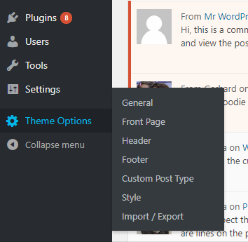
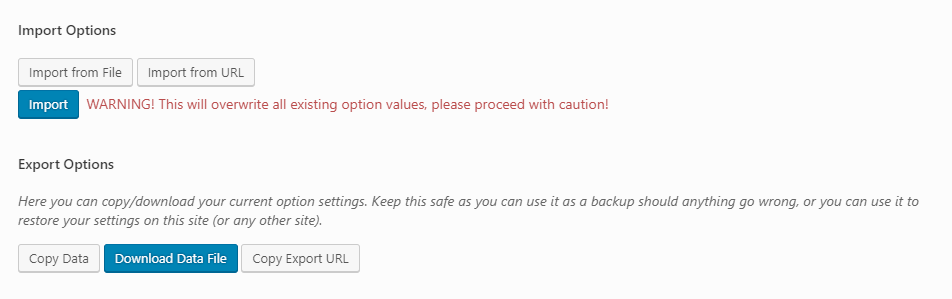

# Theme Options

Camden theme comes with Theme Options page. It allows users to change theme settings without modifying theme files.  Navigate to __Dashboard__ > __Theme Options__ to access the Theme Options.

## General
-----

## Front Page
-----

### Layout
### Slider
### Call to Action Module
### Intro Module
### Content Module
### Feature Module
### Video Module
### Posts Module

### Twitter Module

### Ministry Module

### Sermons Module

### Events Module

### Gallery Module

## Header
-----

## Footer
-----

## Custom Post Type
-----

### Ministry Page
### Sermons Page
### People Page

## Style
-----

### Typography
#### Body Font
#### Primary Heading
#### Secondary Heading
#### Body Text Color
#### Primary Link Color
#### Secondary Text Color
  
### Backgrounds
#### Body Background Color
#### Primary Header Background Color
#### Secondary Header Background Color   
#### Secondary Header Button Color
#### Page Hero Header Background Color
#### Primary Sidebar Background Color
#### Sidebar Child Page Navigation Background Color
#### Footer CTA Background
#### Footer Top Background
#### Footer Bottom Background

### Buttons
#### Primary Button Color
#### Primary Button Color — on Hover
#### Secondary Button Color
#### Secondary Button Color — on Hover
#### Default Button Color
#### Default Button Color — on Hover

### CSS

#### Custom CSS
#### Custom CSS Code

## Import / Export
-----

The Import / Export feature offers users the ability to back up and restore their Theme Options options data. Users can export / import the data in one of three ways: raw data, file and URL.

