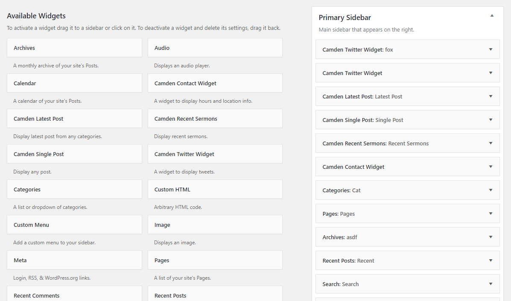

# Widgets 

Camden theme comes with several custom widgets. You can configure the Widgets in your sidebar by from the __Appearance Widgets Screen__.

### Adding a widget
- Click on __Appearance__ > __Widgets__ from the main navigation menu in your Dashboard.
- Add new widgets from the Available Widgets section by dragging them to the Sidebar you want to customize. 
- Preview your site and you should see the content from your new Widget.

### Removing the widget
- Click on Appearance > Widgets from the main navigation menu in your Dashboard.
- On the Widget that is to be removed, click the down arrow (or edit link) in the upper right corner to expand the Widget's interface
- Click the Delete link in the dialog box.
- The Widget will now be removed permanently.
- Alternatively if you want to keep the widget setting for future use, drag it to the __Inactive Widgets__ area instead of the __Available Widgets__ are. It will save your widget settings for future use.
- Preview your site to see your changes.

[More info about Widgets](https://codex.wordpress.org/Appearance_Widgets_Screen ":target=_blank").

## Latest Post Widget
Displays list of the blog's most recent posts from certain categories.

Options:
- __Title__  — description that appears over the list of posts.
- __Number of posts__ — enter the number of posts to display.
- __Post Categories__ — select the desired categories.

## Single Post Widget
Displays a blog posts.

Options:
- __Title__  — description that appears over the post.
- __Post__ — select the post to display.
- __Display excerpt__ — display the post excerpt.

## Contact Widget
Displays location and service hours info.

Options:
- __Title__  — description that appears over widget.
- __Location info__  —  use this area to enter location info in plain text or HTML. 
- __Service hours__ —  use this area to enter service hours info in plain text or HTML. 
- __Map URL__ — enter map URL to be displayed in a new window / tab.
- __Button title__ — text that appears over the button to open the map (default: Get Direction).
- __Automatically add paragraphs__ —  check this to automatically add paragraphs to wrap each block of text in an HTML paragraph tag (recommended for text).

## Recent Sermons Widget
Displays list of sermons.

!> NOTE: Sermons Widget requires [Church Theme Content](https://wordpress.org/plugins/church-theme-content ":target=_blank") plugin.

Options:
- __Title__  — description that appears over the sermons.
- __Number of sermons__ — enter the number of sermons to display.

## Twitter Widget
Displays list of Tweets from any username.

Options:
- __Title__  — description that appears over the Tweets.
- __Username__  — Twitter username.
- __Number of Tweets__ — enter the number of Tweets to display.
- __Display Tweet links__ — display URL in Tweet as link.
- __Display username__ — display username and avatar.
- __Display time__ — display relative time.
- __Display image__ — display Tweet image.

